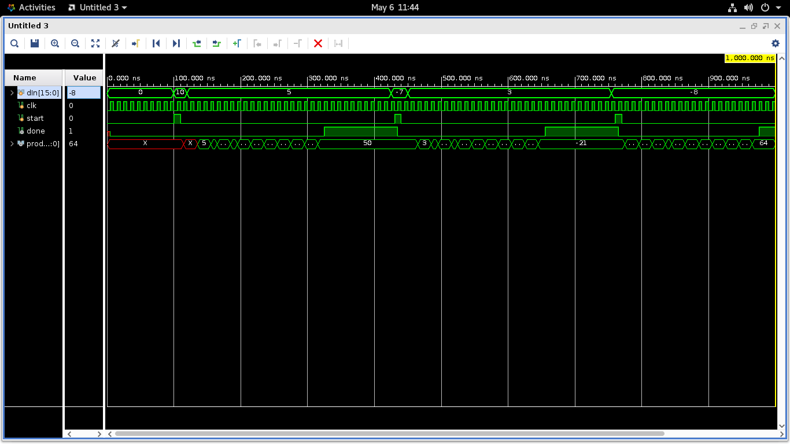
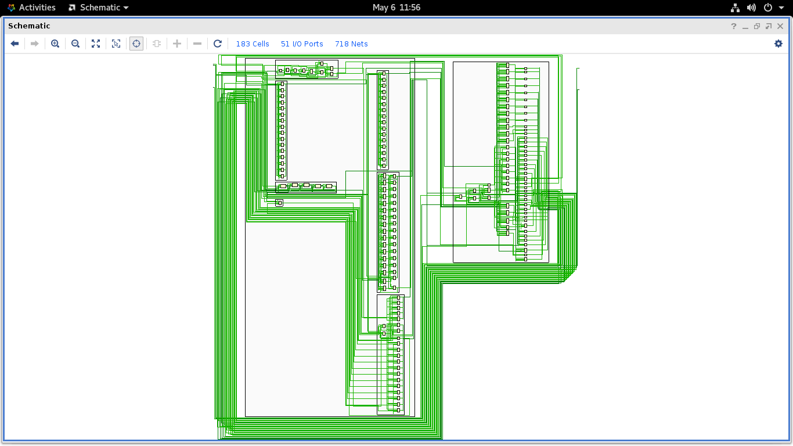
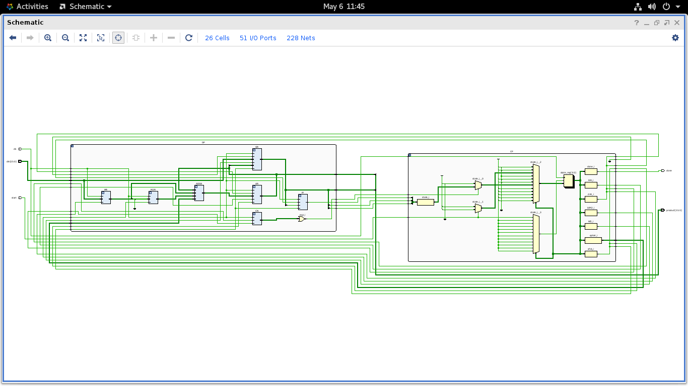
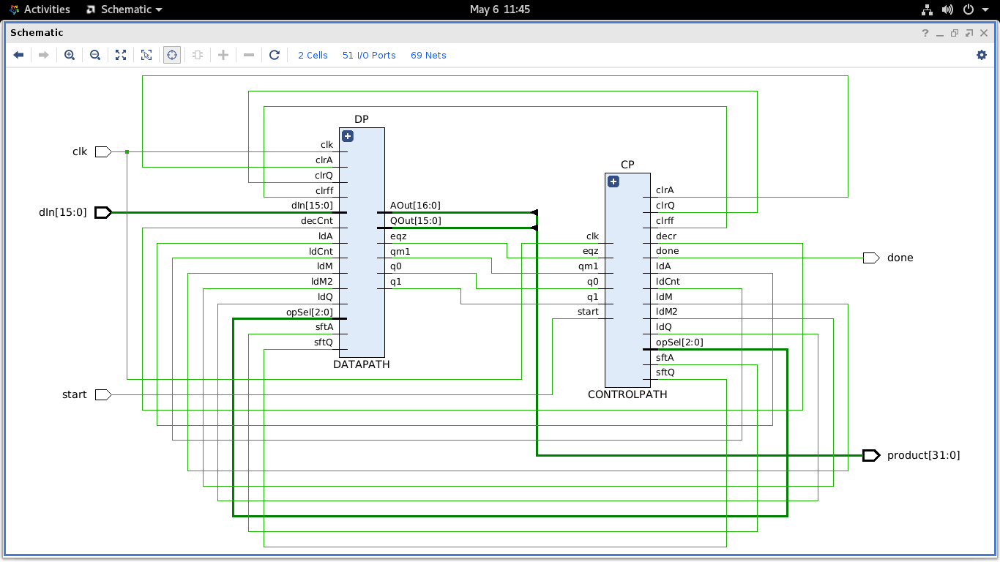
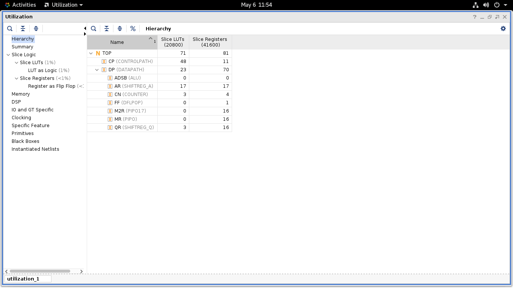
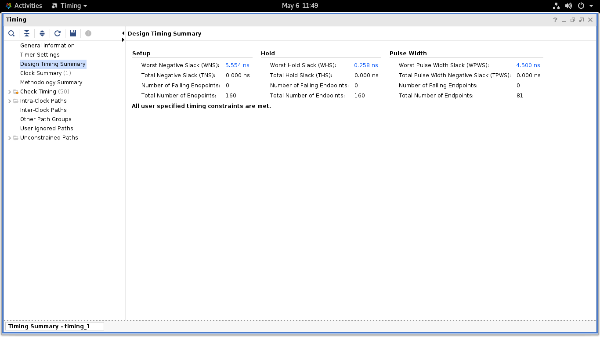
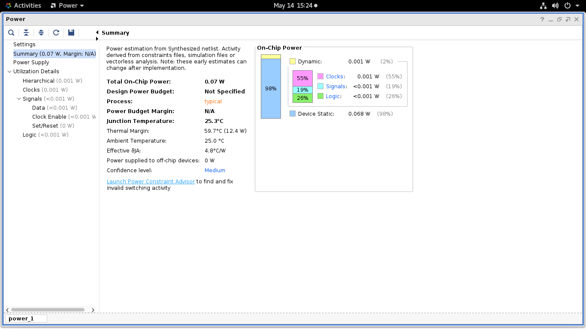

# Radix-4 Modified Booth Multiplier

A 16-bit signed hardware multiplier implemented in Verilog using the **Radix-4 Modified Booth Algorithm**, following the Control Path / Data Path (CP/DP) architectural partitioning. Synthesized and simulated using Xilinx Vivado 2023.2 targeting the **xc7a35tcsg324-1 (Artix-7 35T)** device.

This is the **fourth project** in a series of progressively advanced multiplier implementations, building from basic RTL to algorithmic hardware design.

---

## What is Radix-4 Modified Booth?

Booth's algorithm reduces the number of partial product additions in binary multiplication by detecting transitions between blocks of 0s and 1s in the multiplier. The **Radix-4** variant extends this by examining **3 bits at a time** `{q1, q0, qm1}` instead of 2, processing **2 bits of the multiplier per iteration**. This halves the number of iterations compared to Radix-2 Booth — from 16 iterations to just **8 iterations** for a 16-bit multiplier.

The algorithm correctly handles **signed two's complement** operands, producing a full-precision **32-bit signed product**.

---

## Key Features

- **Signed multiplication** — correctly handles all combinations of positive and negative 16-bit operands
- **8 iterations** — half the cycles of Radix-2 Booth for the same 16-bit input width
- **Precomputed 2M** — the doubled multiplicand is computed and stored in a dedicated register at the start, keeping the ALU combinational path short
- **17-bit accumulator** — AR is extended to 17 bits to absorb overflow from ±2M operations without corrupting the result
- **CP/DP partitioning** — clean separation between the FSM controller and arithmetic datapath
- **Modular design** — each functional unit is a separate Verilog module

---

## Architecture

The system is divided into two primary sections:

### Control Path (FSM)

A 10-state Moore FSM that issues control signals based on the current state:

| State | Action |
|-------|--------|
| S0 | Idle — waits for `start` |
| S1 | Init — clears AR, clears qm1 FF, loads counter to 8, loads MR |
| S8 | Precompute — stores `2M = M << 1` into M2R |
| S2 | Load QR with the multiplier |
| S7 | Evaluate `{q1, q0, qm1}` — used after ldQ and after every shift |
| S3 | AR ← AR + M |
| S4 | AR ← AR − M |
| S5 | AR ← AR + 2M |
| S6 | AR ← AR − 2M |
| SX | Arithmetic right shift `{AR, QR}` by 2, decrement counter |
| S9 | Done — asserts `done`, holds result |

### The Booth Decision Table

Each iteration, S7 evaluates the 3-bit pair `{q1, q0, qm1}`:

| `{q1, q0, qm1}` | Meaning | Action |
|-----------------|---------|--------|
| `000` | Middle of block of 0s | No operation → SX |
| `001` | End of block of 1s | +M → S3 |
| `010` | Isolated 1 | +M → S3 |
| `011` | End of wider block | +2M → S5 |
| `100` | Start of wider block | −2M → S6 |
| `101` | Isolated 0 in block | −M → S4 |
| `110` | Start of block of 1s | −M → S4 |
| `111` | Middle of block of 1s | No operation → SX |

### Data Path

| Module | Description |
|--------|-------------|
| `SHIFTREG_A` | 17-bit accumulator register — arithmetic right shift by 2 |
| `SHIFTREG_Q` | 16-bit multiplier register — shifts by 2, takes `AR[1:0]` as input |
| `PIPO` (MR) | 16-bit register holding the multiplicand M |
| `PIPO17` (M2R) | 17-bit register holding the precomputed 2M |
| `DFLPOP` (FF) | D flip-flop with enable — captures `QR[1]` before each shift |
| `ALU` | 5-operation unit: no-op, +M, −M, +2M, −2M, controlled by 3-bit `opSel` |
| `COUNTER` | 4-bit down counter, initialised to 8 |

### Why S7 is Needed

A critical design detail: `{q1, q0, qm1}` cannot be evaluated on the same clock edge that QR loads or shifts. Register outputs are only valid the cycle *after* the clock edge that drives them. S7 is a dedicated wait/evaluate state that gives these signals exactly one clock cycle to settle before the FSM branches.

### Input Sequence

Both operands share the `dIn` bus and are loaded in two successive clock cycles:

1. Assert `start` with `dIn = multiplicand` → loaded into MR in S1
2. Next cycle: `dIn = multiplier` → loaded into QR in S2

### Final Result

The 32-bit product is `{AR[15:0], QR}`, held stable in S9 until a new `start` pulse is issued.

---

## Synthesis Results

Target device: **xc7a35tcsg324-1 (Artix-7 35T)** | Tool: **Vivado 2023.2** | Mode: Out-of-Context

### Utilization

| Module | Slice LUTs | Slice Registers |
|--------|-----------|-----------------|
| **TOP** | **71** | **81** |
| CP (CONTROLPATH) | 48 | 11 |
| DP (DATAPATH) | 23 | 70 |
| — ALU | 0* | 0* |
| — AR (SHIFTREG_A) | 17 | 17 |
| — CN (COUNTER) | 3 | 4 |
| — FF (DFLPOP) | 0* | 1 |
| — M2R (PIPO17) | 0* | 16 |
| — MR (PIPO) | 0* | 16 |
| — QR (SHIFTREG_Q) | 3 | 16 |

*Absorbed into surrounding logic by Vivado during synthesis — expected behaviour.*

### Timing

| Metric | Value |
|--------|-------|
| Target Clock Period | 10.000 ns (100 MHz) |
| Worst Negative Slack (WNS) | +5.554 ns |
| Total Negative Slack (TNS) | 0.000 ns |
| Failing Endpoints | 0 |
| Status | **All constraints met** ✓ |

### Power

| Metric | Value |
|--------|-------|
| Total On-Chip Power | 0.07 W |
| Dynamic Power | 0.001 W (2%) |
| Device Static | 0.068 W (98%) |
| Junction Temperature | 25.3°C |

---

## Comparison: Radix-2 vs Radix-4 Booth

Both designs synthesized on the same target device (xc7a35tcsg324-1) using Vivado 2023.2.

| Metric | Radix-2 Booth | Radix-4 Booth | Change |
|--------|--------------|---------------|--------|
| Iterations | 16 | 8 | −50% |
| Slice LUTs | 37 | 71 | +92% |
| Slice Registers | 62 | 81 | +31% |
| CP LUTs | 32 | 48 | +50% |
| DP LUTs | 20 | 23 | +15% |
| ALU operations | 2 | 5 | — |
| AR width | 16-bit | 17-bit | +1 bit |
| opSel width | 1-bit | 3-bit | +2 bits |

The Radix-4 design uses more hardware to halve the number of clock cycles required. The LUT increase is primarily in the CONTROLPATH — the wider FSM with more states and a 3-bit opSel signal — while the DATAPATH increase is modest, driven mainly by the wider AR and the additional M2R register.

---

## Simulation Results

**Simulation Waveform**



*Four signed test cases verified: 10×5=50, −7×3=−21, −8×−8=64, 100×200=20000*

**Synthesis Schematic**



**RTL Schematics**





**Utilization Report**



**Timing Summary**



**Power Report**



---

## File Structure

```
radix-4-booth-multiplier/
├── ALU.v
├── CONTROLPATH.v
├── COUNTER.v
├── DATAPATH.v
├── DFLPOP.v
├── PIPO.v
├── PIPO17.v
├── SHIFTREG_A.v
├── SHIFTREG_Q.v
├── TOP.v
├── clk_constraint.xdc
├── testBooth.v
└── reports/
    ├── simulation_waveform.png
    ├── synthesis_schematic.png
    ├── sim_schm_1.png
    ├── sim_schm_2.png
    ├── sim_tab.png
    ├── utilization.png
    ├── utilization_alt.png
    ├── timing_summary.png
    └── power.png
```

---

## Related Work

This project is the fourth in a series of multiplier implementations, each building on the previous:

1. [**RTL Shift-and-Add Multiplier**](https://github.com/vviszard/verilog_codes_vis/tree/main/shift_add_mul) — Basic unsigned multiplication using shift and add at the RTL level. No FSM, no CP/DP partitioning.

2. [**Repeated Addition Multiplier**](https://github.com/vviszard/repeatedAdditionMultiplier) — Introduced the Control Path / Data Path partitioning model with a 5-state FSM. Unsigned only.

3. [**Radix-2 Booth Multiplier**](https://github.com/vviszard/boothMultiplicationAlgorithm) — Extended CP/DP to handle signed multiplication using Booth's algorithm with a 2-bit decision pair, 16 iterations, and arithmetic right shifting.

4. **Radix-4 Modified Booth Multiplier (this project)** — Doubles the throughput of Radix-2 by examining 3-bit groups, halving iterations to 8, at the cost of additional hardware for 2M precomputation and a wider FSM.

---

## Tools Used

- **Xilinx Vivado 2023.2** — Simulation, synthesis, timing and power analysis
- **Target Device** — xc7a35tcsg324-1 (Artix-7 35T), out-of-context synthesis
- **OS** — AlmaLinux
- 
